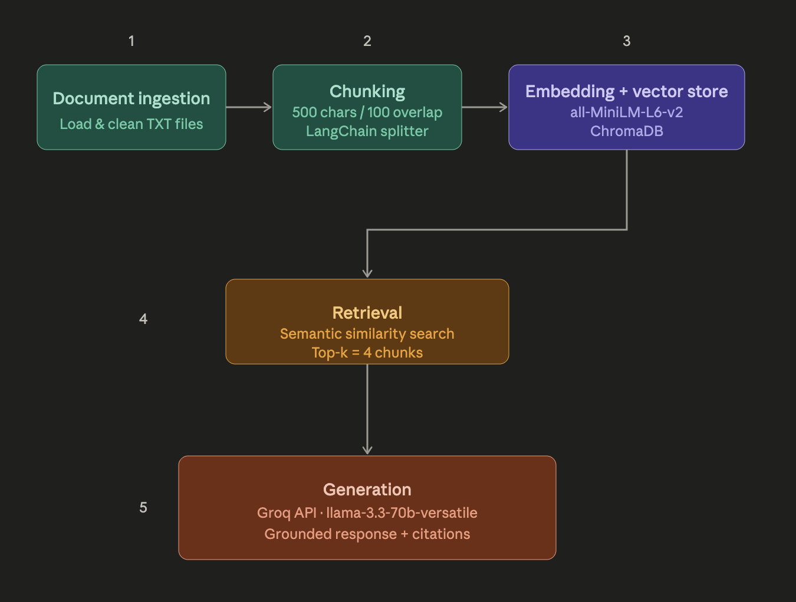

# Project 1 Planning: The Unofficial Guide

> Write this document before you write any pipeline code.
> Your spec and architecture diagram are what you'll use to direct AI tools (Claude, Copilot, etc.) to generate your implementation — the more specific they are, the more useful the generated code will be.
> Update the Retrieval Approach and Chunking Strategy sections if you change your approach during implementation.
> Update this file before starting any stretch features.

---

## Domain

The Unofficial Guide focuses on student-generated knowledge about Computer Science professors and courses at the University of New Orleans (UNO). The system aggregates Rate My Professor reviews and Reddit discussions to answer questions about teaching styles, course difficulty, workload, internship opportunities, and the overall CS program experience.

This knowledge is valuable because it reflects real student experiences that are not available through official university resources. Information about professor expectations, exam difficulty, project workload, and practical advice is scattered across multiple websites and discussion forums, making it difficult for students to search efficiently.

---

## Documents

<!-- List your specific sources: URLs, subreddit names, forum threads, or file descriptions.
     Aim for at least 10 sources that together cover different subtopics or perspectives within your domain. -->

| # | Document |Source | Description | URL or location |  
|---|--------|--------|-------------|-----------------| 
| 1 |christopher_summa.txt |Rate My Professor |Student reviews | data/raw/christopher_summa.txt
| 2 |vassil_rousser.txt  | Rate My Professor| Student reviews| data/raw/vassil_rousser.txt
| 3 |tamjidul_hoque.txt  |Rate My Professor | Student reviews| data/raw/tamjidul_hoque.txt
| 4 |ted_holmberg.txt  |Rate My Professor | Student reviews| data/raw/ted_holmberg.txt
| 5 |james_wagner.txt |Rate My Professor |Student reviews | data/raw/james_wagner.txt
| 6 |manuel_zumbieta.txt  | Rate My Professor| Student reviews| data/raw/manuel_zumbieta.txt
| 7 |abdullah_nur.txt  |Rate My Professor |Student reviews | data/raw/abdullah_nur.txt
| 8 | abdullah_newaz.txt|Rate My Professor | Student reviews|data/raw/abdullah_newaz.txt
| 9 |reddit_cs_at_uno.txt |Reddit (r/UNO) |student discussion about the UNO computer science program | https://www.reddit.com/r/UNO/comments/1o5uoo/cs_at_uno/
| 10 | reddit_uno_vs_loyola_cs.txt|Reddit (r/NewOrleans) |Student discussion comparing the computer science program at UNO and Loyola|https://www.reddit.com/r/NewOrleans/comments/a4qvpi/uno_vs_loyola_computer_science/

---

## Chunking Strategy

<!-- How will you split documents into chunks?
     State your chunk size (in tokens or characters), overlap size, and explain why those
     numbers fit the structure of your documents.
     A review-heavy corpus warrants different chunking than a long FAQ. -->

**Chunk size:** 800

**Overlap:** 150

**Reasoning:**
A chunk size of 800 characters was chosen because the dataset consists mainly of short professor reviews and Reddit comments. This size is large enough to preserve a complete opinion or idea while remaining focused for accurate semantic retrieval.

**Chunk Overlap (150 characters):**  
An overlap of 150 characters helps preserve context when important information appears near the boundary between two chunks. This reduces the risk of splitting related ideas and improves retrieval quality for queries that depend on information spanning adjacent chunks.

---

## Retrieval Approach

<!-- Which embedding model are you using (e.g., all-MiniLM-L6-v2 via sentence-transformers)?
     How many chunks will you retrieve per query (top-k)?
     If you were deploying this for real users and cost wasn't a constraint, what tradeoffs
     would you weigh in choosing a different embedding model — context length, multilingual
     support, accuracy on domain-specific text, latency? -->

**Embedding model:**  all-MiniLM-L6-v2 from the sentence-transformers

**Top-k:** 4

**Production tradeoff reflection:**
If this system were deployed in production, I would evaluate embedding models based on retrieval accuracy, multilingual support, inference speed, context representation, and operational cost. While all-MiniLM-L6-v2 is fast and free to run locally, a larger embedding model could improve retrieval quality for more complex queries at the expense of increased computational cost and latency. The final choice would depend on the application's accuracy requirements, expected query volume, and infrastructure budget.

---

## Evaluation Plan

<!-- List your 5 test questions with their expected correct answers.
     Questions should be specific enough that you can judge whether the system's response
     is right or wrong. "What are good dining halls?" is too vague.
     "What do students say about wait times at [dining hall name] during lunch?" is testable. -->

| # | Question | Expected answer |
|---|----------|-----------------|
| 1 |What do students say about Christopher Summa's teaching style? |The answer should summarize comments from the Christopher Summa reviews, mentioning aspects such as lecture quality, organization, communication, or teaching effectiveness, and cite christopher_summa.txt.|
| 2 |What advice do students give for succeeding in the UNO Computer Science program? |The answer should mention recommendations such as starting projects early, attending office hours, practicing programming regularly, or managing workload, based on the Reddit discussion documents. |
| 3 |What do students say about UNO's cybersecurity and internship opportunities?| The answer should mention areas such as cybersecurity/information assurance, internship opportunities, industry connections, or curriculum quality, citing the Reddit documents.|
| 4 |According to student reviews, what factors make a Computer Science course difficult? | The answer should summarize common themes such as heavy programming projects, challenging exams, workload, or independent learning requirements, using information from multiple professor review documents.|
| 5 |According to the collected discussions, why might a student choose UNO over Loyola for Computer Science? |The answer should mention factors such as the established CS program, cybersecurity specialization, industry connections, internship opportunities, lower cost, or program reputation, citing reddit_uno_vs_loyola_cs.txt. |

---

## Anticipated Challenges

<!-- What could go wrong? Name at least two specific risks with reasoning.
     Consider: noisy or inconsistent documents, missing source attribution, off-topic
     retrieval, chunks that split key information across boundaries. -->

1. Student reviews often contain personal opinions, conflicting experiences, or vague language. As a result, the system may retrieve multiple chunks with different viewpoints, making it difficult to generate a single definitive answer.

2. Semantic search may retrieve chunks that mention similar keywords but are not directly related to the user's question. This could cause the language model to generate incomplete or partially accurate responses if the most relevant information is not among the retrieved chunks.

---

## Architecture

<!-- Draw a diagram of your pipeline showing the five stages:
     Document Ingestion → Chunking → Embedding + Vector Store → Retrieval → Generation
     Label each stage with the tool or library you're using.
     You can use ASCII art, a Mermaid diagram, or embed a sketch as an image.
     You'll use this diagram as context when prompting AI tools to implement each stage. -->

   

---

## AI Tool Plan

<!-- For each part of the pipeline below, describe:
     - Which AI tool you plan to use (Claude, Copilot, ChatGPT, etc.)
     - What you'll give it as input (which sections of this planning.md, which requirements)
     - What you expect it to produce
     - How you'll verify the output matches your spec

     "I'll use AI to help me code" is not a plan.
     "I'll give Claude my Chunking Strategy section and ask it to implement chunk_text()
     with my specified chunk size and overlap" is a plan. -->

**Milestone 3 — Ingestion and chunking:**

**Milestone 4 — Embedding and retrieval:**

**Milestone 5 — Generation and interface:**
